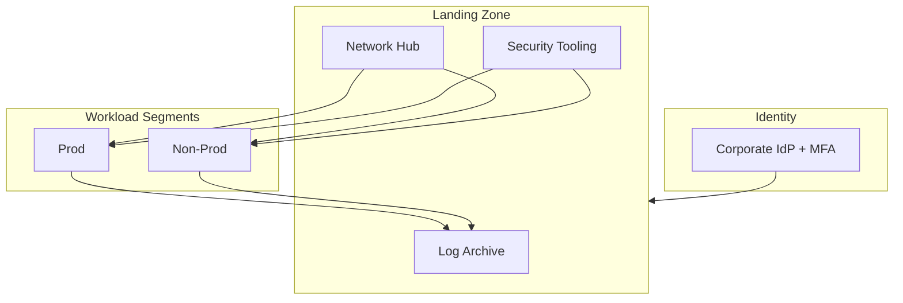

# Landing-Zone Style Architecture Notes

**Classification:** [DEMO] conceptual

## Shared themes (AWS / Azure / GCP)

1. **Identity foundation** — federated IdP, MFA, privileged access workstation / PIM / break-glass monitored.
2. **Account / subscription / project isolation** — prod vs non-prod; security tooling account; log archive.
3. **Network** — hub-and-spoke or shared VPC; centralized egress inspection optional; private connectivity to PaaS.
4. **Logging** — org-level trails/diagnostic settings to immutable storage; SIEM onboarding.
5. **Guardrails** — SCP / Azure Policy / Org Policy constraining public IPs, disabled services, regions.
6. **Encryption** — CMK/CMEK ownership; secrets in vault — never in Terraform state unprotected.
7. **Detect & respond** — native detectors (GuardDuty / Defender / SCC) + SOAR hooks.

## Diagram (mermaid)

