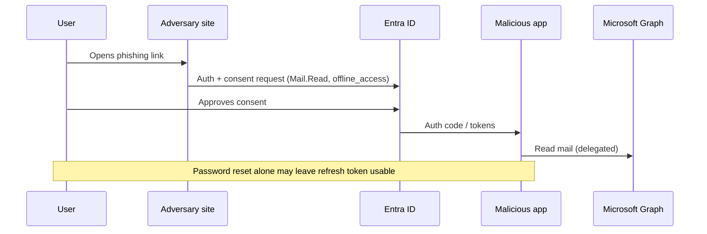

# Research Case Study — Illicit OAuth Consent Grant in Entra ID

| Field | Value |
|-------|-------|
| **Classification** | `[DEMO]` research note — synthetic lab tenant |
| **ID** | `RES-DEMO-2026-05-001` |
| **Author** | Cliff Collins Jr |
| **Date** | 2026-05-12 |
| **Audience** | Identity / Microsoft security research & detection engineering |
| **Status** | Closed — controls + detections documented (lab only) |

---

## Abstract

In a lab Entra ID tenant, a phishing-delivered OAuth consent prompt led a standard user to grant a multi-tenant application **Mail.Read** and **offline_access**. The app then maintained refresh-token access after password reset, until admin consent policies and Continuous Access Evaluation (CAE)–style session controls were applied. This note documents the **attack path**, **evidence**, **customer impact framing**, **remediations**, and **detection ideas** without providing phishing kits or token-theft tooling.

## 1. Problem statement

OAuth consent abuse (“illicit consent grant”) bypasses password theft: the adversary operates as an **authorized application** via delegated permissions. Password reset alone is insufficient if refresh tokens remain valid and consent is not revoked.

**Research question:** What minimal control stack and telemetry close this path for a typical Entra workforce tenant?

## 2. Environment `[DEMO]`

| Component | Lab setup |
|-----------|-----------|
| IdP | Microsoft Entra ID (workforce) |
| Users | Standard user `alex.rivera@[DEMO].lab`; Global Admin break-glass |
| App | Multi-tenant app registration `Demo Graph Helper` (attacker-controlled in lab) |
| Mail | Exchange Online mailbox with non-sensitive synthetic mail |
| Conditional Access | Initially: MFA for all users; **no** app consent restriction |

## 3. Attack path (high level)

**Steps observed (lab):**

1. User authenticates (MFA satisfied).
2. Consent screen shows publisher unverified; user still accepts (no admin consent workflow).
3. App obtains delegated tokens; Graph mail read succeeds.
4. User password reset + MFA re-register **does not** remove app consent; refresh continues until consent revoked / tokens invalidated via admin action.

*No exploit code, phishing HTML, or token-stealing scripts are included in this repository.*

## 4. Evidence & telemetry

| Signal | Where | Notes |
|--------|-------|-------|
| Consent grant | Audit logs — `Consent to application` | AppId, permissions, user |
| Sign-in | Entra sign-in logs | App display name / AppId correlation |
| Graph activity | If enabled — Microsoft 365 unified audit | Mail access patterns |
| Risky user/sign-in | Identity Protection | May **not** fire on legitimate consent UX |

**DEMO finding:** Consent event + unusual AppId with `Mail.Read` from a never-before-seen publisher was the highest-signal early indicator.

## 5. Impact & severity framing

| Dimension | Assessment `[DEMO]` |
|-----------|---------------------|
| Confidentiality | High for mailbox contents of consenting user |
| Integrity | Medium (mail rules / send permissions if granted — not in this lab) |
| Availability | Low |
| Blast radius | Per-user unless app has broad admin consent |
| Persistence | High until consent/token revocation |

**Severity rationale (lab):** Equivalent to sustained mailbox access without password — treat similarly to session compromise with app-shaped persistence.

## 6. Remediations (prefer these in production)

1. **User consent settings:** Restrict user consent to verified publishers / selected permissions; require **admin consent** for mail and offline_access class permissions.
2. **Admin consent workflow** for remaining user requests.
3. **App governance / OAuth app risk** policies; block unverified publishers where feasible.
4. **Conditional Access:** block legacy auth; consider app-enforced restrictions; evaluate Continuous Access Evaluation.
5. **IR runbook:** revoke user consent, disable/delete rogue enterprise app, revoke refresh tokens / revoke sessions, hunt for similar AppIds tenant-wide.
6. **User education:** consent UX red flags (unverified publisher, broad Graph scopes, unexpected redirect host).

## 7. Detection ideas

- Alert on **new enterprise app** + high-risk delegated scopes (`Mail.*`, `Files.*`, `Directory.*`) granted by non-admins.
- Hunt: consent grants where publisher is unverified OR AppId first seen in 30 days.
- Correlate consent with subsequent Graph mail access volume anomalies (where licensed/logged).
- Sample KQL-oriented hunting mindset aligns with [`../../edr-microsoft-defender/kql/`](../../edr-microsoft-defender/kql/) (identity pivots) and identity-compromise playbook.

## 8. Responsible research notes

- Conducted only in an owned lab tenant.
- No third-party production tenants; no disclosure to MSRC required for this DEMO (no product vulnerability claimed — **misconfiguration / abuse of intended OAuth flows**).
- If a product defect were found, path would be: document → MSRC / partner portal → coordinated timelines → public writeup after fix/mitigation guidance.

## 9. Takeaways for Microsoft-style review

- Shows identity attack-path literacy beyond “enable MFA.”
- Separates **abuse of features** from vulns; still delivers detection + control recommendations.
- Evidence-first, remediation-heavy, no weaponization.
