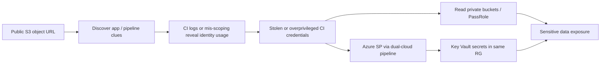

# Research Case Study — Multi-Cloud Toxic Combination

| Field | Value |
|-------|-------|
| **Classification** | `[DEMO]` research note — synthetic cloud lab |
| **ID** | `RES-DEMO-2026-05-002` |
| **Author** | Cliff Collins Jr |
| **Date** | 2026-05-18 |
| **Audience** | Cloud security research (Wiz-style graph / toxic combo thinking) |
| **Status** | Closed — path broken in lab; prevention checklist published |

---

## Abstract

Individually “medium” findings often combine into a **critical toxic path**. In a multi-cloud lab (AWS + Azure), a publicly reachable storage artifact, a leaked automation credential, and an over-privileged cloud identity chained into **read of sensitive objects** and a path toward **subscription/account lateral movement**. This note focuses on **graph reasoning**, prioritization, and preventive controls—not exploit code.

## 1. Problem statement

Cloud risk tools excel at listing misconfigurations. Research value is explaining **which combinations matter**, why priority is high, and how to **break the chain** with least-privilege and exposure reduction.

**Research question:** How does a public storage endpoint + CI secret + admin-capable identity become a single narrative risk, and what minimal fixes collapse it?

## 2. Environment `[DEMO]`

| Cloud | Resource | Issue (standalone severity) |
|-------|----------|------------------------------|
| AWS | S3 bucket `demo-app-artifacts-[DEMO]` | Public `GetObject` on a prefix (Medium) |
| AWS | IAM user `ci-deploy-[DEMO]` access key in GitHub Actions secret (rotated in lab) | Key with `s3:*` + `iam:PassRole` on broad roles (High if leaked) |
| Azure | Service principal used by same pipeline | Contributor on resource group containing Key Vault (High if SP secret leaks) |
| Shared | CI workflow logs | Occasional secret echo in failed job logs (Medium) |

No real customer data; objects were synthetic “customer-export.csv” labels.

## 3. Toxic combination (attack path)

**Chain summary:**

1. **Internet exposure** reveals bucket naming and application artifact metadata.
2. Metadata + public CI patterns hint at automation identity names.
3. **Leaked/overbroad CI credentials** turn reconnaissance into authenticated access.
4. **Privilege** (`s3:*`, `iam:PassRole`, Azure RG Contributor) expands to secrets and lateral control plane actions.
5. Resulting business impact ≫ any single CSPM finding.

## 4. Evidence collected `[DEMO]`

| Node | Evidence type | Result |
|------|---------------|--------|
| S3 | Bucket policy / ACL review | Public read on `public/` prefix; private data mistakenly under same bucket with weaker prefix controls |
| IAM | Policy analysis | Deploy user could pass role to privileged tasks |
| Azure | Role assignments | SP Contributor → Key Vault access policies overly permissive |
| CI | Workflow review | Dual-cloud creds in one pipeline; failed job logged environment dump |

## 5. Impact & prioritization

| Lens | Rating |
|------|--------|
| Data exposure | Critical (synthetic PII-labeled objects reachable after auth) |
| Control plane | High (PassRole / Contributor) |
| Exploitability | High given public start + common CI leak classes |
| **Combined priority** | **Critical toxic combination** — fix chain, not only the public ACL |

**Wiz-style framing:** Prioritize issues that complete a path from **internet → identity → data/control**, not highest CVSS-looking standalone misconfig.

## 6. Breaking the chain (remediations)

1. **Exposure:** Block public access at account/bucket; separate public assets into dedicated buckets; enable Block Public Access.
2. **Secrets:** Remove keys from logs; use OIDC federated roles to AWS/Azure (no long-lived keys in CI); rotate all lab credentials after the exercise.
3. **Identity least privilege:** Replace `s3:*` with prefix-scoped actions; remove `iam:PassRole` or constrain to specific role ARNs; Azure SP → scoped RBAC + KV RBAC with purge protection.
4. **Detection:** CSPM policy for public buckets; CI scanning for secrets; cloud trail/activity alerts on `PassRole`, unusual `GetObject` from new ASNs, SP token use from unexpected IPs.
5. **Architecture:** Split pipelines per cloud; deny dual-cloud super-identities.

Aligns with baselines in [`../../cloud-security/`](../../cloud-security/).

## 7. Detection / measurement ideas

- Graph query concept: `PublicStorage` AND `CredentialInCI` AND `Identity.Privilege >= admin-capable` → ticket severity Critical.
- AWS: CloudTrail `GetObject` on sensitive prefixes from non-VPC endpoints.
- Azure: Sign-in / SP activity outside build agent IP ranges.
- GitHub: secret scanning + push protection (org-level).

## 8. Responsible research notes

- Lab accounts only; no scanning of third-party cloud orgs.
- No proof-of-exploit payloads; path demonstrated via configuration review and authorized lab credentials.
- If this pattern were found in a customer context professionally: private report → remediation → optional public blog after fixes, omitting customer identifiers.

## 9. Takeaways for Wiz-style review

- Emphasizes **combinations and reachability** over alert volume.
- Multi-cloud identity + CI as the glue between CSP findings.
- Clear “how to collapse the path” with preventive architecture, not only detection.
