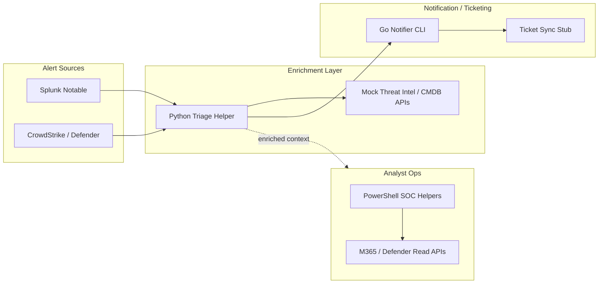

# SOC Automation — Python · Go · PowerShell

**Skills proven:** Alert enrichment/triage automation, API integration with mocks, unit testing, small Go CLIs for notification/ticket sync stubs, PowerShell Defender/M365 helpers (read-heavy), architecture documentation.

## Architecture

## Components

| Component | Path | Purpose |
|-----------|------|---------|
| Python enrichment | [`python-alert-enrichment/`](./python-alert-enrichment/) | Triage helper with mock APIs + pytest |
| Go notifier | [`go-notifier/`](./go-notifier/) | CLI stub for Slack/webhook/ticket notify |
| PowerShell | [`powershell/`](./powershell/) | Defender/M365 read-oriented helpers |

All external calls default to **mocks** — safe for portfolio demos.
